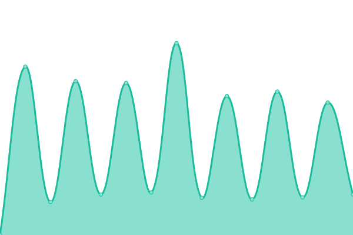
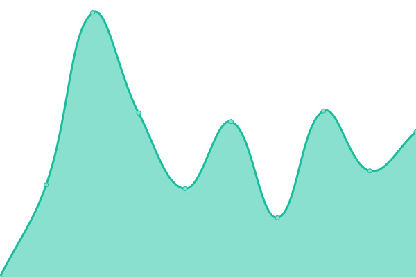

# [📈 Live Status](https://busupdev.github.io/monitoring): <!--live status--> **🟩 All systems operational**

This repository contains the open-source uptime monitor and status page for [busupdev](https://busupdev.github.io/monitoring), powered by [Upptime](https://github.com/upptime/upptime).

With [Upptime](https://upptime.js.org), you can get your own unlimited and free uptime monitor and status page, powered entirely by a GitHub repository. We use [Issues](https://github.com/busupdev/monitoring/issues) as incident reports, [Actions](https://github.com/busupdev/monitoring/actions) as uptime monitors, and [Pages](https://busupdev.github.io/monitoring) for the status page.

<!--start: status pages-->
<!-- This summary is generated by Upptime (https://github.com/upptime/upptime) -->
<!-- Do not edit this manually, your changes will be overwritten -->
<!-- prettier-ignore -->
| URL | Status | History | Response Time | Uptime |
| --- | ------ | ------- | ------------- | ------ |
|  [Business-Up](https://business-up.org) | 🟩 Up | [business-up.yml](https://github.com/busupdev/monitoring/commits/HEAD/history/business-up.yml) | 

 1934ms
     
 | 

<a href="https://busupdev.github.io/monitoring/history/business-up">99.82%</a>
    

|  [MON CHER CAPRISE](https://monchercaprise.ru) | 🟩 Up | [mon-cher-caprise.yml](https://github.com/busupdev/monitoring/commits/HEAD/history/mon-cher-caprise.yml) | 

 2405ms
     
 | 

<a href="https://busupdev.github.io/monitoring/history/mon-cher-caprise">100.00%</a>
    

|  [Скандинавский профиль](https://scandicprofile.ru) | 🟩 Up | [skandinavskij-profil.yml](https://github.com/busupdev/monitoring/commits/HEAD/history/skandinavskij-profil.yml) | 

 2066ms
     
 | 

<a href="https://busupdev.github.io/monitoring/history/skandinavskij-profil">99.83%</a>
    

|  [ВСО Профиль [ Лендинг ]](https://vso-profil.ru) | 🟩 Up | [vso-profil-lending.yml](https://github.com/busupdev/monitoring/commits/HEAD/history/vso-profil-lending.yml) | 

 1113ms
     
 | 

<a href="https://busupdev.github.io/monitoring/history/vso-profil-lending">100.00%</a>
    

|  [ANFI](https://anfiacademy.ru) | 🟩 Up | [anfi.yml](https://github.com/busupdev/monitoring/commits/HEAD/history/anfi.yml) | 

 2240ms
     
 | 

<a href="https://busupdev.github.io/monitoring/history/anfi">99.41%</a>
    

|  [AcademKids [ Основная сеть ]](http://academkids.ru) | 🟩 Up | [academ-kids-osnovnaya-set.yml](https://github.com/busupdev/monitoring/commits/HEAD/history/academ-kids-osnovnaya-set.yml) | 

 2489ms
     
 | 

<a href="https://busupdev.github.io/monitoring/history/academ-kids-osnovnaya-set">100.00%</a>
    

|  [AcademKids [ Франшиза ]](https://franchise.academkids.ru) | 🟩 Up | [academ-kids-franshiza.yml](https://github.com/busupdev/monitoring/commits/HEAD/history/academ-kids-franshiza.yml) | 

 1840ms
     
 | 

<a href="https://busupdev.github.io/monitoring/history/academ-kids-franshiza">100.00%</a>
    

|  [AcademKids [ Летние смены ]](https://leto.academkids.ru) | 🟩 Up | [academ-kids-letnie-smeny.yml](https://github.com/busupdev/monitoring/commits/HEAD/history/academ-kids-letnie-smeny.yml) | 

 1189ms
     
 | 

<a href="https://busupdev.github.io/monitoring/history/academ-kids-letnie-smeny">100.00%</a>
    

|  [AcademKids [ Летние смены ]](https://leto.academkids.ru) | 🟩 Up | [academ-kids-letnie-smeny.yml](https://github.com/busupdev/monitoring/commits/HEAD/history/academ-kids-letnie-smeny.yml) | 

 1189ms
     
 | 

<a href="https://busupdev.github.io/monitoring/history/academ-kids-letnie-smeny">100.00%</a>
    

|  [AcademKids [ Соляная комната ]](https://saltroom.academkids.ru) | 🟩 Up | [academ-kids-solyanaya-komnata.yml](https://github.com/busupdev/monitoring/commits/HEAD/history/academ-kids-solyanaya-komnata.yml) | 

 1644ms
     
 | 

<a href="https://busupdev.github.io/monitoring/history/academ-kids-solyanaya-komnata">100.00%</a>
    

|  [AcademKids [ Личный кабинет ]](https://lk.academkids.ru) | 🟩 Up | [academ-kids-lichnyj-kabinet.yml](https://github.com/busupdev/monitoring/commits/HEAD/history/academ-kids-lichnyj-kabinet.yml) | 

 1307ms
     
 | 

<a href="https://busupdev.github.io/monitoring/history/academ-kids-lichnyj-kabinet">100.00%</a>
    

<!--end: status pages-->

[**Visit our status website →**](https://busupdev.github.io/monitoring)

## 📄 License

- Powered by: [Upptime](https://github.com/upptime/upptime)
- Code: [MIT](./LICENSE) © [Anand Chowdhary](https://anandchowdhary.com), supported by [Pabio](https://pabio.com)
- Data in the `./history` directory: [Open Database License](https://opendatacommons.org/licenses/odbl/1-0/)
